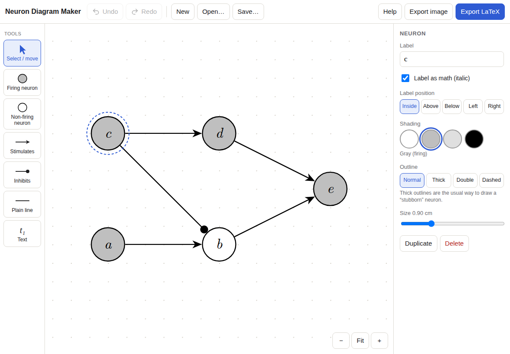

# Neuron Diagram Maker

A point-and-click editor for the **neuron diagrams** used in the metaphysics of causation
(Lewis; Hall & Paul, *Causation: A User's Guide*). Draw neurons and connections, then export
either **TikZ code** to paste into a LaTeX document or an **image** for Word / Google Docs.

It is one web page (`index.html`) with no installation, no account and no internet needed once it has loaded.
It works in Safari, Chrome, Firefox and Edge on Mac, Windows, iPad and phones (mouse, trackpad, finger or Apple Pencil).

## What you can draw

| Thing | Options |
|---|---|
| Neurons | firing (gray), not firing (white), light gray, black · normal / **thick** ("stubborn") / double / dashed outline · size · label inside, above, below, left or right |
| Connections | stimulatory arrow, inhibitory (line ending in a dot), plain line · solid / dashed / dotted · normal / thick · straight or curved · reverse direction |
| Text | free labels such as time stamps *t*₁, *t*₂ · small / normal / large |

Labels are typeset like LaTeX math: `c`, `c_1`, `c_{12}`, `c'`, `c^*`, `\alpha`. Untick "math" for ordinary words.

## Exporting

- **Export LaTeX** → *Copy code* → paste into the `.tex` file where the diagram should go.
  The only requirement is `\usepackage{tikz}` once in the preamble — no TikZ libraries are needed,
  because arrowheads are drawn as plain filled shapes. Layout choices: centered, numbered figure with caption,
  bare `tikzpicture`, or a complete test document for Overleaf.
- **Export image** → *Copy image* and paste, or *Download* a PNG (150 / 300 / 600 dpi; the dpi is written into the file
  so Word inserts it at its true size) or an SVG. On iPad, *Share / Save to Photos…* opens the iOS share sheet.

## Saving

The current diagram is kept automatically in the browser. *Save…* downloads it as a `.json` file;
*Open…* loads one back for editing.

## Putting it online (for the person who hosts it)

The folder is a static site — any static host works. With GitHub Pages:

1. Merge this folder into `main`.
2. Repository **Settings → Pages → Build and deployment → Source: Deploy from a branch**, branch `main`, folder `/ (root)`, Save.
3. After a minute the app is at `https://<github-user>.github.io/<repo-name>/NeuronDiagrams/`.

(GitHub Pages on a free account requires the repository to be public.)

### Installing on an iPad

Open the link in **Safari** → tap the **Share** button → **Add to Home Screen** → **Add**. It then opens full-screen
from its own icon like an app, and works offline.

### Using it without hosting

Double-clicking `index.html` on a Mac or PC opens a fully working copy in the browser.
(Offline caching and the iPad home-screen icon need it to be served from a web address.)

## Files

| File | Purpose |
|---|---|
| `index.html` | the whole app (HTML, CSS and JavaScript, no dependencies) |
| `manifest.webmanifest`, `icon*.png`, `icon.svg` | name and icon for "Add to Home Screen" |
| `sw.js` | service worker that caches the app for offline use |
