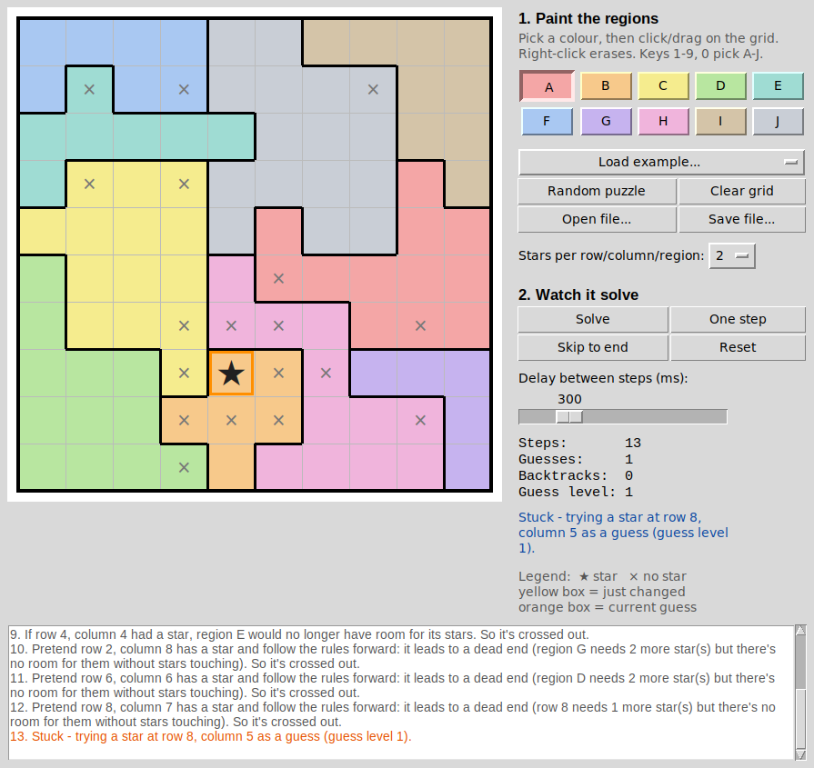

# Star Battle Solver

A fast Star Battle puzzle solver written in Python, with a point-and-click window where you can **paint in the regions of a 10×10 puzzle and watch the solver work it out step by step**. Each step comes with a plain-English explanation.



---

## Contents

1. [What is Star Battle?](#what-is-star-battle)
2. [Features](#features)
3. [Requirements](#requirements)
4. [Quick start](#quick-start)
5. [Using the window](#using-the-window)
6. [Puzzle file format](#puzzle-file-format)
7. [Using it without the window](#using-it-without-the-window)
8. [How the solver works](#how-the-solver-works)
9. [How fast is it?](#how-fast-is-it)
10. [How random puzzles are made](#how-random-puzzles-are-made)
11. [Files in this folder](#files-in-this-folder)
12. [Running the tests](#running-the-tests)
13. [Troubleshooting](#troubleshooting)
14. [Limitations and ideas for improvement](#limitations-and-ideas-for-improvement)

---

## What is Star Battle?

You get a 10×10 grid split into 10 coloured **regions**. Place stars so that:

1. every **row** has exactly **2** stars,
2. every **column** has exactly **2** stars,
3. every **region** has exactly **2** stars, and
4. **no two stars touch**, not even diagonally.

A well-made puzzle has exactly one answer.

## Features

- **Paint regions with the mouse.** Pick a colour (A–J), then click or drag. Right-click erases.
- **Watch it solve in real time.** Stars appear, cells get crossed out, guesses are tried and undone, and every step is explained in a log.
- **Play/pause, single-step, speed slider and "skip to end"** controls.
- **Three example puzzles** (easy, medium, hard) are included.
- **Random puzzle generator** that only produces puzzles with exactly one solution.
- **Open and save** puzzles as plain text files.
- **Input checks:** warns about unpainted cells, the wrong number of regions, or regions split into separate pieces.
- **Fast:** a typical 10×10 puzzle takes a few hundredths of a second (see [How fast is it?](#how-fast-is-it)).
- **No extra installs.** It only uses Python's standard library.
- The solver also handles other grid sizes and 1 star per row/column/region. The window is built for 10×10, but you can pick 1 or 2 stars there.

## Requirements

- **Python 3.8 or newer.** Download it from [python.org](https://www.python.org/downloads/).
- **tkinter**, Python's built-in window toolkit. It comes with the python.org installers for Windows and macOS. On some systems you have to add it yourself:
  - **Ubuntu / Debian Linux:** `sudo apt install python3-tk`
  - **Fedora Linux:** `sudo dnf install python3-tkinter`
  - **macOS with Homebrew Python:** `brew install python-tk`

  To check whether you have it, run `python -m tkinter`. A small test window should open.

The solver itself (`solver.py`) doesn't need tkinter, only the window does.

## Quick start

```bash
# 1. Go into this folder
cd StarBattleSolver

# 2. Start the program
python star_battle_gui.py
```

(On macOS/Linux you may need to type `python3` instead of `python`.)

The window opens with the easy example already loaded. Press **Solve**.

## Using the window

### 1. Enter a puzzle

| What you want | How |
|---|---|
| Pick a region colour | Click a lettered button A–J, or press keys `1`–`9` and `0` |
| Paint cells | Left-click or left-drag on the grid |
| Erase cells | Right-click or right-drag (on a Mac trackpad: two-finger click) |
| Load an included example | **Load example...** menu |
| Make a brand-new puzzle | **Random puzzle** (takes about a second) |
| Start over | **Clear grid** |
| Load or save a text file | **Open file...** / **Save file...** |

**Tip for copying a puzzle from a book or app:** colours don't have to match. All that matters is which cells share a region. Paint each region a different letter, and thick borders will appear automatically between regions so you can compare against the original.

### 2. Watch it solve

| Button | What it does |
|---|---|
| **Solve** | Starts the animation. While it's running, the same button becomes **Pause** / **Resume**. |
| **One step** | Pauses and shows exactly one more step. Good for following the logic closely. |
| **Skip to end** | Finishes the rest instantly. |
| **Reset** | Removes the stars and crosses so you can edit again. (Painting a cell does this automatically.) |
| **Delay slider** | Time between steps, from 0 ms (as fast as possible) to 1.5 seconds. |

**Reading the board:**

- ★ = star, × = definitely not a star.
- **Yellow box:** the cells the latest step changed.
- **Orange box:** the cell the solver is currently guessing.
- **Red box:** a guess that just failed and was erased.
- **Guess level:** how many guesses deep the solver currently is. 0 means everything on the board was proven by logic.

The **log** at the bottom explains every step in words and is colour-coded: green for stars, grey for crosses, orange for guesses, red for dead ends.

## Puzzle file format

A puzzle is a plain text file with 10 lines of 10 characters. Each character is the region that cell belongs to:

```
# Lines starting with # are comments and are ignored.
HHHHGGGJJJ
HCHHGGGIII
CCHCGGGIII
CCCCGGGIII
CCCCGGGEII
FFFDDGGEII
FDDDDDEEBI
ADADDDBEBI
AAAABBBBBB
AAAAAABBBB
```

- Any 10 different symbols work: letters, digits, anything. Spaces inside a line are ignored.
- Files saved from the window always use the letters A–J.
- Put your own puzzles in the `puzzles/` folder and they'll appear in the **Load example...** menu next time you start the program.

## Using it without the window

**From a terminal:**

```bash
python solver.py puzzles/example_3_hard.txt
```

This prints the solution (`*` = star, lowercase letters = regions) and how long it took. For a 1-star puzzle, add the star count: `python solver.py my_puzzle.txt 1`.

**Generate a random puzzle:**

```bash
python puzzle_generator.py > puzzles/my_new_puzzle.txt
```

**From your own Python code:**

```python
from solver import StarBattleSolver, load_puzzle

puzzle = load_puzzle("puzzles/example_2_medium.txt")   # or a list of 10 strings
solver = StarBattleSolver(puzzle, stars=2)

answer = solver.solve()              # list of rows of True/False, or None if impossible
print(solver.guesses, "guesses")

# Is the answer unique?
print(StarBattleSolver(puzzle).count_solutions(limit=2))   # 1 means unique

# Step-by-step, the same way the window animates it:
for step in StarBattleSolver(puzzle).solve_steps():
    print(step.action, step.message)
```

## How the solver works

The code is commented line by line in beginner-friendly language. This section is the overview.

### The big idea: logic first, guess only when stuck

Every cell is always **unknown**, **star** or **blank** (definitely no star). The solver repeats a cycle:

```
          ┌──────────────────────────────────────────────┐
          ▼                                              │
  1. LOGIC: apply Rules 1-4 until none of them helps     │
          │                                              │
          ├── board broke? ──► this branch is wrong      │
          ├── board full?  ──► SOLVED                    │
          ▼                                              │
  2. GUESS: put a pretend star on a carefully chosen     │
            cell, and repeat the whole cycle on a COPY   │
          │                                              │
          ▼                                              │
  3. If the copy breaks: throw it away. Now we KNOW that │
     cell is blank, which is real progress ─────────────┘
```

Computer scientists call this **constraint propagation with backtracking search**. The rules (constraint propagation) do almost all of the work, so very few guesses are needed.

### The four rules

A **unit** means any row, column or region. Each needs exactly 2 stars.

**Rule 1: Counting.** For every unit:
- if it already has its 2 stars, cross out the rest of it;
- if the number of open cells equals the number of stars it still needs, they're all stars;
- if it can't possibly fit the stars it needs without them touching, the board is broken.

Every time a star is placed, its 8 neighbours are crossed out, because stars can't touch.

**Rule 2: Squeeze (pigeonhole).** Take a band of, say, 3 neighbouring rows. It holds exactly 3 × 2 = 6 stars.
- If 3 regions lie **entirely inside** the band, they need all 6 of those stars, so every band cell belonging to any other region is crossed out.
- If only 3 regions **touch** the band at all, the band's 6 stars must come from them, which fills them up. So their cells **outside** the band are crossed out.

This is checked for every band of rows and every band of columns, of every width.

**Rule 3: Quick what-if.** For each open cell, imagine a star there for a moment. It would cross out its neighbours, and it might complete its row, column or region. Would some unit then be left without room for its stars? If so, the star can't go there, so the cell gets crossed out.

**Rule 4: Deep what-if.** Like Rule 3, but the solver follows the consequences further. On a scratch copy of the board, it places the pretend star and keeps applying Rules 1 and 2 like falling dominoes. If that chain reaction ends in something impossible, the cell gets crossed out on the real board. The scratch work isn't shown, only the conclusion. This is the rule that keeps the number of real guesses so low.

Rules are tried cheapest first. Whenever one makes progress, the solver goes back to Rule 1, because new information often unlocks the simple rules again.

### Choosing a good guess

When all four rules are stuck, the solver:

1. finds the unit with the **fewest ways** left to place its remaining stars (for example, "needs 1 star and has only 2 open cells" means just 2 ways), and
2. in that unit, picks the cell whose star would **cross out the most open neighbours**.

A guess like that either succeeds or fails quickly. Failing still helps, because the cell then becomes a proven blank.

### How "real time" works

`solve_steps()` is a Python **generator**: a function that can pause partway through. Each time the solver does something worth showing, it hands back a `Step` object containing:

- the action type,
- the cells involved,
- a plain-English message,
- a snapshot of the whole board, and
- the current guess depth.

Then it pauses. The window draws that step, waits for the delay you set, and asks for the next one. Because of this design the solver doesn't need to know anything about the window, and the window doesn't need to know how the solver thinks.

### Why it's efficient

- **The rules do the work.** 19 of 30 random test puzzles needed no guesses at all, and none needed more than 4.
- **Smart guesses.** Guessing in the most constrained place keeps the search tiny.
- **Cheap bookkeeping.**
  - Cells are numbered 0–99 in one flat list, so copying the board for a guess is quick.
  - Each cell's neighbours and units are worked out once at the start.
  - Rule 2 stores which rows and columns each region touches as a *bitmask* (a whole number used as a row of on/off switches), so it can compare whole sets in one operation.
- **Skipping needless work.**
  - Rule 3 only re-checks the units an imaginary star would actually affect.
  - Rule 4 skips drawing snapshots during its silent scratch work.

## How fast is it?

Measured with Python 3.11 on a Linux cloud machine, not counting animation time. Your computer may be faster or slower.

| Puzzle | Steps shown | Guesses | Time |
|---|---|---|---|
| `example_1_easy.txt` | 69 | 0 | ~6 ms |
| `example_2_medium.txt` | 130 | 3 | ~0.18 s |
| `example_3_hard.txt` | 256 | 5 | ~0.31 s |
| 30 random puzzles | — | 0–4 | median ~26 ms, max ~0.31 s |

In the window, the total time is mostly the delay you choose. At 300 ms per step, the hard puzzle takes about a minute and a quarter to animate. Slide the delay to 0, or press **Skip to end**, to see it finish instantly.

## How random puzzles are made

`puzzle_generator.py` builds the answer first and the puzzle around it:

1. **Secretly place 20 valid stars:** 2 per row, 2 per column, none touching.
2. **Pair the stars up** and draw a short path between the two stars of each pair. Each path is the seed of one region.
3. **Grow the 10 regions outward** at random until every cell belongs to one. Each region now contains exactly 2 secret stars, so the secret answer is valid.
4. **Ask the solver whether there's a second answer.** If there is, find a cell that has a star in the unwanted answer but not in the secret one. Hand that cell to a neighbouring region (keeping regions in one piece). The secret answer is unaffected, but the unwanted one now has 3 stars in one region and 1 in another, so it's ruled out. Repeat until only one answer remains.

This usually takes about a second. The generator runs the solver without Rule 4 because it solves many throwaway puzzles and only needs speed there.

## Files in this folder

```
StarBattleSolver/
├── star_battle_gui.py    ← start here: the window (tkinter)
├── solver.py             ← the solving logic (no window code)
├── puzzle_generator.py   ← makes random puzzles with a unique answer
├── test_solver.py        ← automatic tests
├── puzzles/              ← example puzzles (plain text)
│   ├── example_1_easy.txt
│   ├── example_2_medium.txt
│   └── example_3_hard.txt
├── screenshot.png
└── README.md
```

## Running the tests

```bash
cd StarBattleSolver
python -m unittest test_solver.py
```

The tests check that:

- every example is solved correctly and has exactly one answer;
- random puzzles are unique and solved correctly;
- a 6×6 one-star puzzle works;
- an impossible puzzle is reported as having no solution;
- bad input is rejected; and
- the step-by-step reports are well-formed.

All answers are double-checked by `check_solution()`, which tests the four rules independently of the solver.

## Troubleshooting

| Problem | Fix |
|---|---|
| `ModuleNotFoundError: No module named 'tkinter'` | Install tkinter (see [Requirements](#requirements)). |
| `python` isn't recognised | Try `python3`, or on Windows `py`. |
| Examples menu says "(no examples found)" | Run the program from a copy that still has the `puzzles/` folder next to `star_battle_gui.py`. |
| "Wrong number of regions" | A 10×10 puzzle needs exactly 10 regions. Make sure you've used all 10 colours. |
| "This puzzle has no solution" | Usually a painting mistake. Compare each region's outline with the original puzzle. |
| Right-click doesn't erase on a Mac | Use a two-finger click, or just select the right colour and paint over the cell. |

## Limitations and ideas for improvement

- **The window is fixed at 10×10.** `solver.py` and `puzzle_generator.py` work for any size; the window would need a size selector.
- **Rule 4 isn't how humans usually think.** Its "follow the dominoes" reasoning is valid, but it can chain several steps together that a person would write out one at a time. Each log message names the dead end it found, so you can check the reasoning yourself.
- **No difficulty rating** for random puzzles. A rating could be estimated from which rules and how many guesses the solver needed.
- **More human techniques** could be added as named rules. One example is the 2×2 block rule: every 2×2 square holds at most one star, and tiling an area with such squares gives an upper limit on how many stars that area can hold.
